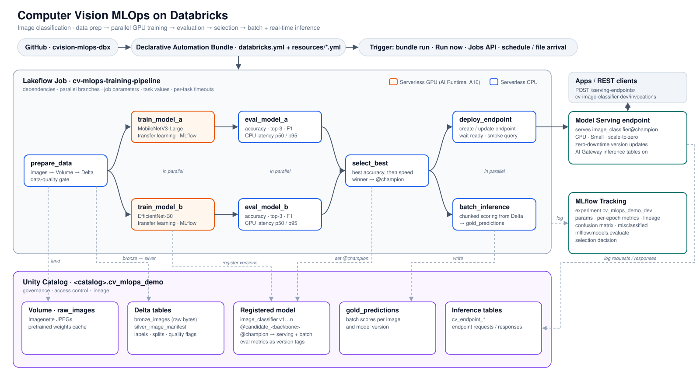

# Computer Vision MLOps on Databricks

An end-to-end image-classification pipeline on Databricks: data prep → **two models trained in parallel on
serverless GPUs** → evaluation → automatic best-model selection → **batch inference and real-time serving in
parallel**. Everything is defined as code in one bundle and runs as one Lakeflow Job, with MLflow + Unity
Catalog as the system of record.



Dataset: [Imagenette](https://github.com/fastai/imagenette) (10 ImageNet classes, ~13k images).
Models: torchvision ImageNet backbones fine-tuned via transfer learning — `mobilenet_v3_large` vs
`efficientnet_b0` by default; `resnet50` and `vgg16` are one variable away.

## Databricks components

| Component | Role in this project | Defined in | Docs |
|---|---|---|---|
| **Lakeflow Jobs** | Orchestrates the 8 tasks above: dependencies, parallel branches, parameters, timeouts, notifications. | `resources/cv_training_pipeline.job.yml` | [Jobs](https://docs.databricks.com/aws/en/jobs) |
| **Declarative Automation Bundles** (formerly Databricks Asset Bundles) | Packages code + job + UC/MLflow resources; `validate` / `deploy` / `run` per target (dev, prod). | `databricks.yml`, `resources/*.yml` | [Bundles](https://docs.databricks.com/aws/en/dev-tools/bundles) |
| **Serverless compute for jobs** | CPU tasks run on serverless with a pinned environment (CPU-only torch). No clusters to manage. | `environments: cpu` in the job file | [Job compute](https://docs.databricks.com/aws/en/jobs/compute) |
| **AI Runtime (serverless GPU)**, Public Preview | The two training tasks each run on a serverless A10 GPU with the Databricks AI environment (PyTorch + MLflow preinstalled). | `compute.hardware_accelerator: GPU_1xA10`, `environments: gpu` | [AI Runtime](https://docs.databricks.com/aws/en/machine-learning/ai-runtime), [jobs](https://docs.databricks.com/aws/en/machine-learning/ai-runtime/connecting) |
| **Unity Catalog volumes** | Raw images + cached pretrained weights. | `resources/cv_mlops.uc.yml` | [Volumes](https://docs.databricks.com/aws/en/volumes) |
| **Delta tables** | `bronze_images` (raw bytes) → `silver_image_manifest` (labels, splits, quality flags) → `gold_predictions`. | `src/notebooks/01_prepare_data.py`, `05_batch_inference.py` | |
| **MLflow tracking** | Params, per-epoch metrics, dataset lineage, confusion matrix, misclassified images, `mlflow.models.evaluate`, selection decision. | experiment in `resources/cv_mlops.uc.yml` | [MLflow](https://docs.databricks.com/aws/en/mlflow/models) |
| **Models in Unity Catalog** | Registry for every trained version; the winner gets the `@champion` alias (UC uses aliases instead of stages). | `resources/cv_mlops.uc.yml`, `src/cv_mlops/pipeline.py` | [Model lifecycle](https://docs.databricks.com/aws/en/machine-learning/manage-model-lifecycle) |
| **Mosaic AI Model Serving** | CPU endpoint (Small, scale-to-zero) serving the champion; updated with zero downtime. | `src/notebooks/06_deploy_endpoint.py` | [Model Serving](https://docs.databricks.com/aws/en/machine-learning/model-serving) |
| **AI Gateway inference tables** | Every endpoint request/response is logged to a Delta table in the schema (rows can take up to an hour to land). | `06_deploy_endpoint.py` | [Inference tables](https://docs.databricks.com/aws/en/ai-gateway/inference-tables) |

## The pipeline (Lakeflow Job)

A Lakeflow Job is a DAG of **tasks**. A task starts when the tasks it `depends_on` finish, so tasks with
the same upstream task run **in parallel**. Tasks pass small results downstream as
[task values](https://docs.databricks.com/aws/en/jobs/task-values): set with `dbutils.jobs.taskValues.set(...)`
and read with `{{tasks.<task>.values.<key>}}`. For example, `train_model_a` publishes `model_version`, and
`eval_model_a` receives it as a parameter.

| Task | What it does | Compute | Code |
|---|---|---|---|
| `prepare_data` | Downloads images into the volume; builds bronze/silver tables with deterministic train/val/test splits; **fails the run on data-quality problems** before any GPU time is used; caches pretrained weights. | Serverless CPU | `01_prepare_data.py` |
| `train_model_a` ∥ `train_model_b` | The same notebook, run with a different `backbone`. Transfer learning, MLflow logging, registers a UC model version tagged `@candidate_<backbone>`. Refuses to register if validation accuracy is below a sanity threshold. | Serverless GPU (A10) | `02_train.py` |
| `eval_model_a` ∥ `eval_model_b` | Loads the **registered** model from UC and scores the held-out test set: accuracy, top-3, F1, confusion matrix, CPU latency p50/p95. | Serverless CPU | `03_evaluate.py` |
| `select_best` | Highest test accuracy wins; if both are within `accuracy_tolerance` (0.5%), the faster model wins. Logs the comparison and sets `@champion`. | Serverless CPU | `04_select_best.py` |
| `batch_inference` ∥ `deploy_endpoint` | Streams images from Delta through the registered model in chunks → `gold_predictions` ∥ create/update the serving endpoint, wait until ready, live smoke query. | Serverless CPU | `05_batch_inference.py`, `06_deploy_endpoint.py` |

Notebooks are thin wrappers. All logic lives in `src/cv_mlops/` and is unit-tested locally. The model is an
MLflow pyfunc with preprocessing built in, so evaluation, batch scoring and serving all run the exact same
code on the same artifact.

## Project layout

```
databricks.yml                         bundle: variables, dev/prod targets, sync rules
resources/cv_mlops.uc.yml              UC schema, volume, registered model, MLflow experiment
resources/cv_training_pipeline.job.yml the Lakeflow Job (tasks, environments, parameters)
src/notebooks/01..06_*.py              one notebook per task (see src/README.md)
src/cv_mlops/                          shared library: data, modeling, serving (pyfunc), evaluation, selection
scripts/query_endpoint.py              send local images to the endpoint
tests/                                 unit tests + local end-to-end smoke test
```

## Run it in your workspace

### 1. Prerequisites

| Requirement | Why |
|---|---|
| A workspace with Unity Catalog and [serverless compute for jobs](https://docs.databricks.com/aws/en/jobs/compute) | Every CPU task runs on serverless. |
| [AI Runtime](https://docs.databricks.com/aws/en/machine-learning/ai-runtime) (serverless GPU, Public Preview) with A10 GPUs available, plus the Databricks AI environment. A workspace admin may need to enable these previews. | The two training tasks. Set `gpu_type` if your workspace offers a different GPU. |
| `USE CATALOG` and `CREATE SCHEMA` on an existing catalog | The bundle creates its own schema, with a volume, tables and the model, inside that catalog. |
| Permission to create Model Serving endpoints | The `deploy_endpoint` task. |
| Outbound internet access from serverless to `s3.amazonaws.com`, `download.pytorch.org` and `pypi.org` | Downloads the dataset, CPU torch wheels and pretrained weights. Allow these hosts if serverless network policies restrict egress. |
| [Databricks CLI](https://docs.databricks.com/aws/en/dev-tools/cli/install) (tested with v1.17.0) | Deploys and runs the bundle. |

### 2. Configure

No workspace details are stored in this repo. The CLI profile selects the workspace, and the catalog is a
required [bundle variable](https://docs.databricks.com/aws/en/dev-tools/bundles/variables):

```bash
git clone https://github.com/RamVegiraju/cvision-mlops-dbx.git && cd cvision-mlops-dbx
databricks auth login --host https://<your-workspace-url> --profile my-ws

export DATABRICKS_CONFIG_PROFILE=my-ws      # or pass -p my-ws to every command
export BUNDLE_VAR_catalog=<your_catalog>     # or --var catalog=<your_catalog>, or a local
                                             # .databricks/bundle/dev/variable-overrides.json (git-ignored)
```

Optional variables, all in `databricks.yml` and overridable with `--var name=value`:

| Variable | Default | Purpose |
|---|---|---|
| `schema` | `cv_mlops_demo` (dev), `cv_mlops_prod` (prod) | Schema the bundle creates |
| `gpu_type` | `GPU_1xA10` | Serverless GPU for each training task |
| `backbone_a` / `backbone_b` | `mobilenet_v3_large` / `efficientnet_b0` | The two models trained in parallel (`resnet50` and `vgg16` also work) |
| `epochs`, `max_per_class` | `5`, `0` (full dataset) | Training length and data subset |
| `accuracy_tolerance` | `0.005` | Within this accuracy gap, the faster model wins |
| `endpoint_name` | `cv-image-classifier-dev` (dev) | Serving endpoint name |

### 3. Deploy and run

```bash
databricks bundle validate --strict -t dev   # checks config; fails fast if catalog is not set
databricks bundle deploy -t dev              # creates the schema, volume, model, experiment and job

# Smoke run on a small subset (about 15 min, including the first endpoint build)
databricks bundle run cv_training_pipeline -t dev --params max_per_class=20,epochs=1

# Full run
databricks bundle run cv_training_pipeline -t dev
```

`--params` overrides [job parameters](https://docs.databricks.com/aws/en/jobs/run-now) for a single run.
`--var` changes the deployed configuration.

Other ways to start the pipeline:
- **UI:** Jobs & Pipelines → `[dev] cv-mlops-training-pipeline` → *Run now* (or *Run now with different parameters*).
- **CLI / REST:** `databricks jobs run-now <job_id>` or the Jobs API `POST /api/2.2/jobs/run-now`.
- **Automatic:** add a schedule or trigger to the job ([triggers](https://docs.databricks.com/aws/en/jobs/triggers)).
  The options are scheduled, file arrival (for example, new images landing in the volume), table update,
  model update, and continuous:
  ```yaml
  # resources/cv_training_pipeline.job.yml, under the job
  trigger:
    file_arrival:
      url: /Volumes/<catalog>/cv_mlops_demo/raw_images/incoming/
  ```

### 4. Clean up

```bash
databricks serving-endpoints delete cv-image-classifier-dev   # created by the deploy task, not by the bundle
databricks bundle destroy -t dev                              # removes the resources the bundle created
```

## Query the endpoint

```bash
python scripts/query_endpoint.py --profile <profile> --endpoint cv-image-classifier-dev path/to/image.jpg
```

Or call it over REST (input is a base64-encoded image):

```bash
curl -X POST "https://<workspace-host>/serving-endpoints/cv-image-classifier-dev/invocations" \
  -H "Authorization: Bearer $DATABRICKS_TOKEN" -H "Content-Type: application/json" \
  -d "{\"dataframe_records\": [{\"image\": \"$(base64 -i image.jpg)\"}]}"   # Linux: base64 -w0
# → {"predictions": [{"label": "parachute", "label_idx": 8, "confidence": 0.97, "top_k": "{...}"}]}
```

## Local development

```bash
uv venv --python 3.12 .venv
uv pip install --python .venv/bin/python torch==2.11.0 torchvision==0.26.0 mlflow==3.13.0 \
  pillow==12.0.0 numpy==2.3.4 pandas==2.3.3 scikit-learn==1.7.2 matplotlib pytest databricks-sdk
PYTHONPATH=src .venv/bin/python -c "from cv_mlops.data import download_and_extract; download_and_extract('scratch/data')"
.venv/bin/python -m pytest -q
```

The smoke test trains both backbones for one epoch on a small subset. It then registers each model in a local
MLflow registry, reloads it, predicts, evaluates and selects, using the same code the job runs.

## Design notes

- **Version parity.** CPU tasks use CPU-only builds of the same torch, torchvision and MLflow versions that the GPU
  AI environment ships, so a GPU-trained model loads identically everywhere.
- **Fail fast.** No retries, a timeout on every task, data-quality and sanity-accuracy checks before expensive steps,
  and `max_concurrent_runs: 1`. Downstream tasks pin the selected model *version* rather than reading the alias.
- **The registry connects the tasks.** Evaluation writes metrics to model-version tags, and selection reads them.
  Adding a third model means adding one train/eval task pair. For many models, use a
  [`for_each`](https://docs.databricks.com/aws/en/jobs/configure-task) task.
- **Next steps for production.** Retrain on a file-arrival trigger. Promote only if the new model beats the current
  `@champion`, using an [If/else task](https://docs.databricks.com/aws/en/jobs/if-else). Deploy the `prod` target
  from CI with `run_as` set to a service principal.
